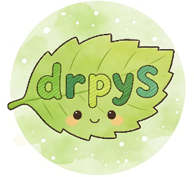

# drpyS(drpy-node)

[![zread](https://img.shields.io/badge/Ask_Zread-_.svg?style=plastic&color=00b0aa&labelColor=000000&logo=data%3Aimage%2Fsvg%2Bxml%3Bbase64%2CPHN2ZyB3aWR0aD0iMTYiIGhlaWdodD0iMTYiIHZpZXdCb3g9IjAgMCAxNiAxNiIgZmlsbD0ibm9uZSIgeG1sbnM9Imh0dHA6Ly93d3cudzMub3JnLzIwMDAvc3ZnIj4KPHBhdGggZD0iTTQuOTYxNTYgMS42MDAxSDIuMjQxNTZDMS44ODgxIDEuNjAwMSAxLjYwMTU2IDEuODg2NjQgMS42MDE1NiAyLjI0MDFWNC45NjAxQzEuNjAxNTYgNS4zMTM1NiAxLjg4ODEgNS42MDAxIDIuMjQxNTYgNS42MDAxSDQuOTYxNTZDNS4zMTUwMiA1LjYwMDEgNS42MDE1NiA1LjMxMzU2IDUuNjAxNTYgNC45NjAxVjIuMjQwMUM1LjYwMTU2IDEuODg2NjQgNS4zMTUwMiAxLjYwMDEgNC45NjE1NiAxLjYwMDFaIiBmaWxsPSIjZmZmIi8%2BCjxwYXRoIGQ9Ik00Ljk2MTU2IDEwLjM5OTlIMi4yNDE1NkMxLjg4ODEgMTAuMzk5OSAxLjYwMTU2IDEwLjY4NjQgMS42MDE1NiAxMS4wMzk5VjEzLjc1OTlDMS42MDE1NiAxNC4xMTM0IDEuODg4MSAxNC4zOTk5IDIuMjQxNTYgMTQuMzk5OUg0Ljk2MTU2QzUuMzE1MDIgMTQuMzk5OSA1LjYwMTU2IDE0LjExMzQgNS42MDE1NiAxMy43NTk5VjExLjAzOTlDNS42MDE1NiAxMC42ODY0IDUuMzE1MDIgMTAuMzk5OSA0Ljk2MTU2IDEwLjM5OTlaIiBmaWxsPSIjZmZmIi8%2BCjxwYXRoIGQ9Ik0xMy43NTg0IDEuNjAwMUgxMS4wMzg0QzEwLjY4NSAxLjYwMDEgMTAuMzk4NCAxLjg4NjY0IDEwLjM5ODQgMi4yNDAxVjQuOTYwMUMxMC4zOTg0IDUuMzEzNTYgMTAuNjg1IDUuNjAwMSAxMS4wMzg0IDUuNjAwMUgxMy43NTg0QzE0LjExMTkgNS42MDAxIDE0LjM5ODQgNS4zMTM1NiAxNC4zOTg0IDQuOTYwMVYyLjI0MDFDMTQuMzk4NCAxLjg4NjY0IDE0LjExMTkgMS42MDAxIDEzLjc1ODQgMS42MDAxWiIgZmlsbD0iI2ZmZiIvPgo8cGF0aCBkPSJNNCAxMkwxMiA0TDQgMTJaIiBmaWxsPSIjZmZmIi8%2BCjxwYXRoIGQ9Ik00IDEyTDEyIDQiIHN0cm9rZT0iI2ZmZiIgc3Ryb2tlLXdpZHRoPSIxLjUiIHN0cm9rZS1saW5lY2FwPSJyb3VuZCIvPgo8L3N2Zz4K&logoColor=ffffff)](https://zread.ai/hjdhnx/drpy-node)
[](https://deepwiki.com/hjdhnx/drpy-node)  
  
nodejs作为服务端的drpy实现。全面升级异步写法  
~~积极开发中，每日一更~~，当前进度 `100%`  
~~找工作中，随缘更新~~  
上班当牛马，下班要带娃，阶段性佛系趁娃睡觉熬夜更新

### 常用超链接

* [本项目主页-免翻](https://git-proxy.playdreamer.cn/hjdhnx/drpy-node)
* [DS源仓库-去中心化](http://183.87.133.60:5678/)
* ~~[最新DS本地包-适配皮卡丘](/gh/release)~~
* [DS本地包下载中心](/admin/download)
* [接口文档](docs/apidoc.md) | [接口列表如定时任务](docs/apiList.md) |
  ~~[小猫影视-待对接T4](https://github.com/waifu-project/movie/pull/135)~~
* [代码质量评估工具说明](docs/codeCheck.md) | [DS项目代码评估报告](docs/codeCheckReport.md)
* [本地配置接口-动态本地](/config?healthy=1&pwd=$pwd)
* [本地配置接口-动态外网/局域网](/config/1?healthy=1&pwd=$pwd)
* [其他配置接口-订阅过滤](/docs/sub.md)
* [python环境](/docs/pyenv.md) | [DS项目环境变量说明](/docs/envdoc.md)
* php环境(详见 spider/php/readme.md) 不在这里赘述
* [猫源调试教程](/docs/catDebug.md)
* [接口压测教程](/docs/httpTest.md)
* [AI编程工具 trae](https://www.trae.ai/account-setting#subscription) | 邮编ZIP输入: 518000
* [推荐使用AI模型-GLM4.7](https://www.bigmodel.cn/glm-coding?ic=DRV3C8M5NX) | [GLM配置文档](https://docs.bigmodel.cn/cn/coding-plan/tool/trae)
* [免费AI-360纳米](https://bot.n.cn/)|[免费AI-当贝AI](https://ai.dangbei.com/chat)|[国外聚合全模型](https://lmarena.ai/)
* [本站防止爬虫协议](/robots.txt)
* [油猴脚本-反切屏检测](/public/monkey/check_screen_leave.user.js)
* [油猴脚本-通用网页脚本框架](/public/monkey/clipboard-sender.user.js)
* [油猴脚本-通用网页脚本框架自定义指令集](/public/monkey/自定义指令集-道长.json)

-------------------------

### 插件应用列表

* [Admin 管理面板](/apps/admin)
* [DrPlayer](/apps/drplayer)
* [Music控制台](/lx/)
* [音乐播放器](/music/)
* [Websocket实时日志](/apps/websocket)
* [cookie管理插件](/apps/cookie-butler/index.html)
* [cron表达式插件](/apps/cron-generator/index.html)
* [剪切板智能推送插件](/apps/clipboard-pusher/index.html)
* [DS源可用性检测插件](/apps/source-checker/index.html)
* [DS解析检测插件](/apps/vip-parser/index.html)
* [DS源配置编辑插件](/apps/source-editor/index.html)
* [DS内存图片管理器插件](/apps/image-manager/index.html)
* [DS时钟插件-白色时钟](/apps/clock/white_clock.html)|[日历时钟](/apps/clock/index.html)
* [DS庆祝页面-完结撒花](/apps/happy/index.html)
* [bookReader](/apps/book-reader)
* [系统备份与恢复](/apps/backup-restore/index.html)
* [代码加解密工具](/admin/encoder)
* [央视点播解析工具](/proxy/央视大全[官]/index.html)
* [在线猫ds源主页](/cat/index.html)
* [V我50支付凭证生成器](/authcoder?len=10&number=1)

### 同作者项目

* [DS源适配猫影视](https://github.com/hjdhnx/CatPawOpen/tree/ds-cat)
* [DS插件项目-golang](https://github.com/hjdhnx/drpy-plugin)
* [DS 二进制插件项目-pup-sniffer](https://github.com/hjdhnx/pup-sniffer)
* [DS 二进制插件项目-file-index](https://github.com/hjdhnx/file-index)
* [DS web插件项目-drplayer](https://github.com/hjdhnx/DrPlayer)
* [drpy2打包项目](https://github.com/hjdhnx/drpy-webpack)
* [drpyS的写源技能仓库](https://github.com/hjdhnx/drpy-node-skill)

### 免费壳子推荐

* [酷9](https://wwbty.lanzouv.com/iGoUV3d3hxuf)
* [千寻](https://wwbty.lanzouv.com/iSSN93d3hyzg)
* [皮卡丘](https://github.com/ingriddaleusag-dotcom/PeekPiliRelease)

## 更新记录

### 20260831b

更新至V2.0.4

1. 插件市场新增 cctv-h5e：央视频点播 hls_h5e 与频道直播 cdrm 加密TS 解密为标准 MPEG-TS，三端二进制（win-x64 / linux-x64 / linux-arm64）
2. 新增央视频演示源：直播（17 频道入口）+ 8 个栏目点播，解密代理客户端只访问主服务端口
3. 修复全局 CATE_EXCLUDE 含「新闻」误杀分类、市场卡片 platform-arch 平台判定
4. 播放 URL 补伪后缀 #.m3u8/#.ts 兼容嗅探型播放器；AGENTS.md 沉淀二进制编译与 cntv 对接经验

### 20260831

更新至V2.0.3

1. 源管理新增启用/停用（单个开关+批量）：停用源退出配置与订阅分发，全源检测不受影响
2. 源验证拆分为 语法检查 + 接口全流程验证（首页/分类/详情/搜索/可选播放，三级评分）
3. 插件体系新增 python 型 runtime（.venv + pip 依赖管理）；hongguo-bridge 播放桥插件案例支持自定义端口
4. 文件管理支持创建/编辑/删除：托管目录限 json|js|txt|m3u|conf，框架文件受保护禁删，编辑接入 monaco 高亮
5. 修复 /unified-proxy 回环播放 403、TVBox 壳子参数兼容回归；QUICK ACTIONS 与侧边栏对齐

### 20260830b

更新至V2.0.2

1. 插件体系新增 python 型 runtime：插件目录内独立 .venv + pip 依赖管理，启停/日志/崩溃处理与 node 型一致
2. 全能代理新增自身回环链路支持与 unified_proxy_self_redirect 开关（默认回环转发，可切 302 直连单层代理）
3. 首个 python 型私有插件案例 hongguo-bridge（红果短剧播放桥）：手动上传安装，规范见 docs/python-plugin-design.md

### 20260830

更新至V2.0.1

1. hipy/php 源代理新增 toBytes=2/3 流式语义，可稳定代理数 GB、1 小时以上媒体资源
2. /proxy 注入 __range/__mediaProxy 保留参数，py/php 基类新增流式代理辅助方法
3. 修复 php 调用超时遗留孤儿进程、空代理 500、超时输家 unhandledRejection 等问题
4. hipy 引擎死代码清理、三处模块缓存 LRU 化、console 输出统一收口至分级日志
5. t4api.md 补齐 toBytes 代理协议文档；桥接超时/单包上限支持环境变量覆写

### 20260829

更新至V2.0.0

1. 管理界面「Instrument Panel」全站重构：暗色/亮色双主题、全新 UI 组件库与移动端适配
2. 接口文档集成 Swagger UI，文档由路由 schema 自动生成，与实际接口永不脱节
3. 新增插件市场与验证码识别代理（OCR/滑块/旋转）
4. 文件管理预览接入 monaco 编辑器，支持语法高亮
5. 修复十余处内存与资源泄漏，长时间运行更稳定
6. 大规模重构收敛重复实现，新增零依赖测试体系

[点此查看V2.0.0详细更新内容](docs/updateRecord.md)

### 20260825

更新至V1.4.8

### 20260718

更新至V1.4.7

### 20260527

更新至V1.4.6

### 20260428

更新至V1.4.5

### 20260418

更新至V1.4.4

### 20260322

更新至V1.4.3

### 20260321

更新至V1.4.2

[点此查看完整更新记录](docs/updateRecord.md)

**注意事项**

总是有人遇到各种奇葩问题，像什么没弹幕，访问/config/1服务马上崩溃等等，能自行解决最好，解决不了我建议你使用下方安装教程
`3.道长腾讯轻量云服务器安装方案`
跟我一样还有问题那就不可能了，我能用你即能用

## 基础框架

todo:

1. js里的源能否去除export开头，保持跟qjs一致
2. js里的源，像一级这种异步js，里面调用未定义的函数，能否不通过函数参数传入直接注入调用
3. 在源的各个函数调用的时候动态注入input、MY_URL等局部变量不影响全局。搞了半天没成功，有点难受，待解决

写源的函数不可以使用箭头函数，箭头函数无法拿到this作用域就没法获取input和MY_URL变量

精简去除的库:

1. axios(这个去不掉，刚需，后端请求才能拿到set-cookie)
2. jsonpath
3. underscore
4. pino-pretty
5. deasync

## 参考资料

* [crypto-js-wasm使用教程](docs/crypto-js-wasm/readme-CN.md)
* [webdav使用教程](docs/webdav.md)
* [puppeteer使用教程](docs/pupInstall.md)
* [drpyS源属性说明](docs/ruleAttr.md)
* [drpy2写源简述](docs/ruleDesc.md)
* [关姐算法搭建说明](docs/suanfa.md)
* [重要问题记录](docs/issue.md)

## 问题说明

1. windows上直接运行index.js可能会发现运行过程中的日志打印出中文乱码。建议通过yarn dev运行或者在package.json里点击dev脚本运行
2. `pinyin` 库依赖的 `nodejieba` 跑路了现在无法完成安装
3. `new Promise` 里发生的错误无法被外部try catch 导致程序崩溃，如 `番薯动漫.js` 里的写法

## 安装说明

1.zy安装方案

* [多平台安装教程](https://zy.catni.cn/otherShare/drpyS-build.html)

2.自动化安装方案（直接薅道长羊毛）

* 终端执行

`bash -c "$(curl -fsSLk https://git-proxy.playdreamer.cn/hjdhnx/drpy-node/raw/refs/heads/main/install/autorun.sh)"`

* 添加定时方案

`echo "30 7 * * * cd /patch && bash -c \"\$(curl -fsSLk https://git-proxy.playdreamer.cn/hjdhnx/drpy-node/raw/refs/heads/main/install/autorun.sh)\" >> /patch/drpyslog.log 2>&1" | crontab -`

或者下载脚本到本地后

`chmod a+x /path/autorun.sh`

`echo "30 7 * * * bash /path/autorun.sh  >> /path/logfile.log 2>&1" | crontab -`

命令说明 /patch 为脚本存放路径（脚本放在与源码同级的自定义目录中）

3.道长腾讯轻量云服务器安装方案

```shell
mkdir /home/node_work
cd /home/node_work
curl -o- https://raw.githubusercontent.com/nvm-sh/nvm/v0.35.3/install.sh | bash
source ~/.bashrc
nvm install 22
npm config set registry https://registry.npmmirror.com
npm i -g cnpm --registry=https://registry.npmmirror.com
npm i -g pm2 yarn@1.22.19
git clone https://git-proxy.playdreamer.cn/hjdhnx/drpy-node.git
cd drpy-node
yarn
yarn pm2
pm2 logs drpys
pm2 ls
pm2 stop drpys
pm2 start drpys
pm2 restart drpys
```

## 代理转发功能测试

* [代理转发ds](/req/https://github.com/hjdhnx/drpy-node)
* [代理转发百度](/req/https://www.baidu.com)
* [代理转发范冰冰直播源](/req/https://live.fanmingming.com/tv/m3u/ipv6.m3u)

## 友链(白嫖接口服务)

* [猫影视git文件加速](https://github.catvod.com/)
* [猫影视多功能主页](https://catvod.com/)
* [ZY写源教学](https://zy.catni.cn/editSource/edit-grammar.html)
* [源动力-新](https://tvshare.cn/)
* [源动力-老](https://sourcepower.top/index)
* [电竞专业反应测试](https://www.arealme.com/brain-memory-game/zh/)
* [桌面启动器](https://wwbty.lanzouv.com/iDZaP3d3i5ud)
* [不知名获取网盘CK工具](http://sspa8.top:8100/pan/admin/index.php)

## AI接入

* [讯飞星火](https://console.xfyun.cn/services/bm4)
* [deepseek](https://platform.deepseek.com/api_keys) | [对话](https://chat.deepseek.com/)
* [讯飞智能体](https://xinghuo.xfyun.cn/botcenter/createbot)
  | [对话](https://xinghuo.xfyun.cn/botweb/0b83d4b1c0447e82ea00fe9485bd9353)
  | [数据集](https://xinghuo.xfyun.cn/botcenter/private-dataset)
* [KIMI](https://platform.moonshot.cn/console/info) | [对话](https://kimi.moonshot.cn/)

## 版权

本项目主体框架由道长开发，项目内相关源收集于互联网，可供学习交流测试使用，禁止商用或者直接转卖代码，转载代码请带上出处。

## 免责声明

1. 此程序仅用于学习研究，不保证其合法性、准确性、有效性，请根据情况自行判断，本人对此不承担任何保证责任。
2. 由于此程序仅用于学习研究，您必须在下载后 24 小时内将所有内容从您的计算机或手机或任何存储设备中完全删除，若违反规定引起任何事件本人对此均不负责。
3. 请勿将此程序用于任何商业或非法目的，若违反规定请自行对此负责。
4. 此程序涉及应用与本人无关，本人对因此引起的任何隐私泄漏或其他后果不承担任何责任。
5. 本人对任何程序引发的问题概不负责，包括但不限于由程序错误引起的任何损失和损害。
6. 如果任何单位或个人认为此程序可能涉嫌侵犯其权利，应及时通知并提供身份证明，所有权证明，我们将在收到认证文件确认后删除此程序。
7. 所有直接或间接使用、查看此程序的人均应该仔细阅读此声明。本人保留随时更改或补充此声明的权利。一旦您使用或复制了此程序，即视为您已接受此免责声明。
